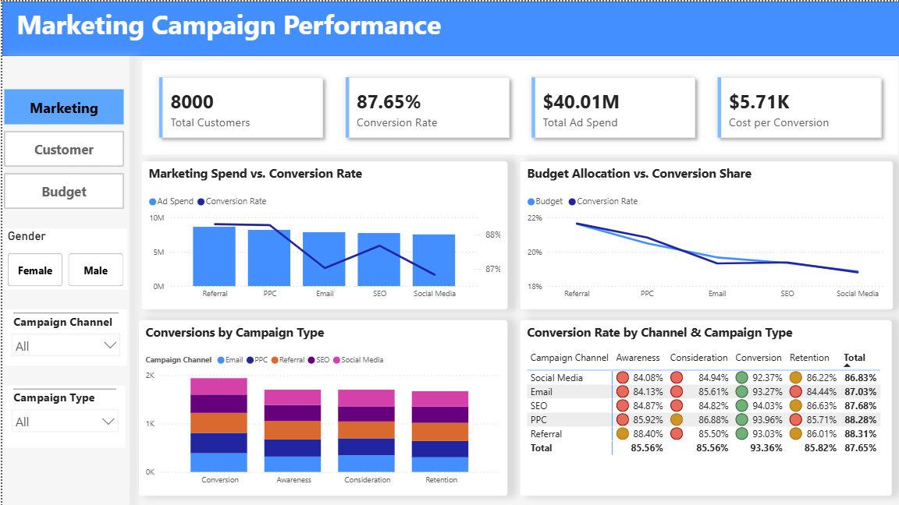
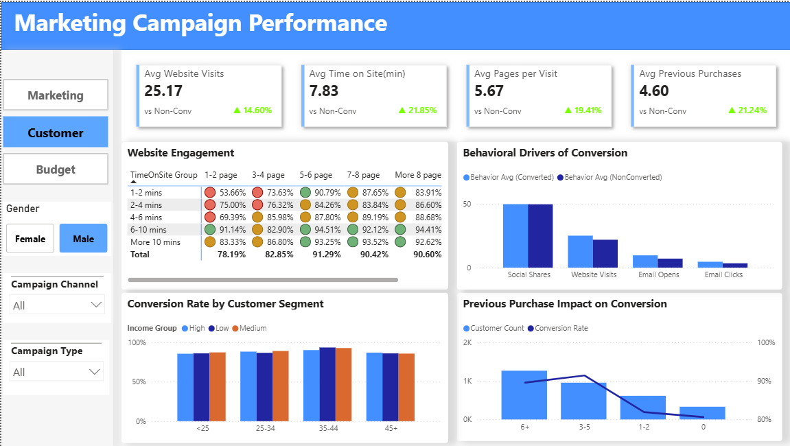
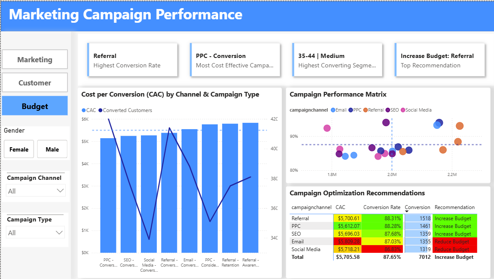

# 📊 Marketing Campaign Performance Dashboard
## 🛠️ Tools Used
- Python
- SQL Server
- Power BI
- DAX
## 📌 Executive Summary
This project analyzes marketing campaign performance using SQL, Power BI, and DAX to identify the most effective marketing channels, understand customer conversion behavior, and recommend budget optimization strategies.

The project is organized into three interactive dashboards:
- Marketing Performance Overview
- Customer Behavior Analysis
- Budget Optimization & Recommendations

## ❓ Business Problem

Marketing managers invest budgets across multiple campaign channels and campaign types, but it is often difficult to answer questions such as:
- Which marketing channel generates the highest conversion rate?
- Which campaign type delivers the best performance?
- Which customer segments are most likely to convert?
- Which customer behaviors influence conversion?
- How should marketing budgets be reallocated for better ROI?

## 📁 Dataset

The dataset contains approximately 8,000 customer records including:
- Customer Demographics
- Campaign Information
- Website Behavior
- Email Engagement
- Social Engagement
- Previous Purchase History
- Loyalty Points
- Marketing Spend
- Conversion Metrics

## 📊 Dashboard Architecture & Key Visuals
### 📊 Dashboard 1 - Marketing Performance Overview

**Key Insights**
- Referral and PPC are the most effective marketing channels, achieving the highest Conversion Rates (approximately 88%) while contributing the largest share of converted customers.
- Conversion Campaigns consistently outperform other campaign types across all channels, maintaining Conversion Rates above 92%, with SEO – Conversion achieving the highest rate (94.03%).
- Social Media and Email consume a significant portion of the marketing budget but generate lower conversion performance than the other channels, indicating opportunities for budget optimization.
- Overall analysis indicates that the current marketing budget is not fully allocated based on conversion performance, creating opportunities to improve ROI through budget reallocation.

---
### 👥 Dashboard 2 – Customer Conversion Insights

**Key Insights**
- Website engagement is the most important factor influencing conversion; customers who view 5–6 pages and spend 6–10 minutes on the website achieve Conversion Rates above 91%.
- Converted customers demonstrate significantly higher Website Visits, Email Engagement, and Previous Purchases than non-converted customers, indicating that customer engagement is a strong predictor of purchase behavior.
- Customers aged 35–44 with medium income represent the highest-converting customer segment, making them the priority target for future marketing campaigns.
- Returning customers with 3–5 previous purchases achieve higher conversion rates than first-time customers, highlighting the importance of effective Customer Retention strategies.

---
### 💰 Dashboard 3 – Budget Optimization & Recommendations

**Key Insights**
- Referral, PPC, and SEO provide the best investment performance by combining high Conversion Rates with low Cost per Conversion, making them the highest-priority channels for budget expansion.
- The PPC – Conversion campaign combination delivers the highest cost efficiency, generating a large number of converted customers while maintaining a Customer Acquisition Cost (CAC) below the overall average.
- Email and Social Media either produce lower conversion performance or incur higher acquisition costs than the other channels, indicating that these channels should be optimized or receive reduced investment.
- The Marketing Action Matrix suggests that reallocating budget from lower-performing channels to Referral, PPC, and SEO would improve budget efficiency and maximize overall marketing performance.

## 🎯 Actionable Recommendations

Based on the analysis across the three dashboards, the following strategic recommendations are proposed to improve marketing performance and maximize budget efficiency.

### 💰 1. Optimize Marketing Budget Allocation

- Reallocate **10–15%** of the marketing budget from underperforming channels (**Social Media** and **Email**) to higher-performing channels.
- Increase investment in **Referral** and **PPC**, particularly for **Conversion** campaigns, which consistently achieved the highest conversion rates and lower customer acquisition costs (CAC).
- Continuously monitor Cost per Conversion (CAC) to ensure budget is allocated to the most efficient campaign-channel combinations.

---

### 🌐 2. Improve Website Engagement & Conversion Rate Optimization (CRO)

- Enhance website UI/UX to encourage visitors to:
  - Stay on the website for **more than 6 minutes**.
  - View **at least 5 pages per session**.
- Optimize landing pages, navigation, and call-to-action (CTA) placement to increase customer engagement and improve conversion rates.

---

### 👥 3. Strengthen Customer Targeting & Retention

- Prioritize marketing campaigns targeting customers aged **35–44 years** with **medium income**, the highest-converting customer segment identified in the analysis.
- Expand customer loyalty and retention programs for customers with **3–5 previous purchases**, as they demonstrate significantly higher conversion probabilities than first-time customers.
- Increase personalized email campaigns and remarketing efforts to maintain long-term customer relationships and encourage repeat purchases.

---

### 📈 Expected Business Impact

Implementing these recommendations is expected to:

- Improve overall marketing ROI.
- Reduce customer acquisition costs (CAC).
- Increase conversion rates through better customer targeting.
- Enhance long-term customer retention and lifetime value.
- Support data-driven marketing budget allocation decisions.
